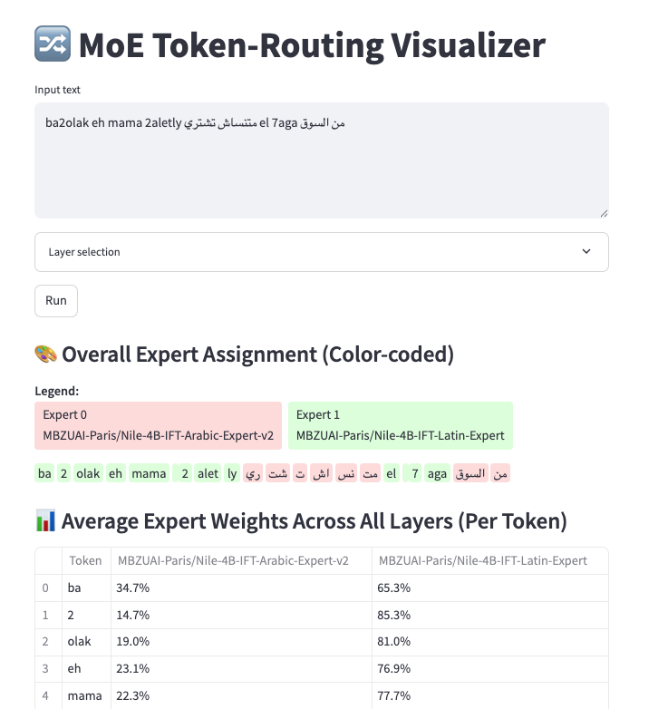

# 🔀 MoE Routing Visualizer

*A Streamlit dashboard to see **which tokens each expert processes** in a Mixture‑of‑Experts model built with MixtureKit.*


---

## 1. Prerequisites

* A MixtureKit‑built model (e.g. the **BTX** model created by `examples/example_build_moe_btx.py`).
* Python ≥ 3.10 inside the same conda environment where you installed MixtureKit.
* The extra packages `streamlit` and `pandas` (already listed in `requirements.txt`).

---

## 2. Launch the app

```bash
# From the repo root
streamlit run vis.py
```

The first run downloads / loads the model and caches it (see ✅ in the terminal). Subsequent launches are instant.

---

## 3. Interface tour

| UI element                | What it does                                                                                                                       |
| ------------------------- | ---------------------------------------------------------------------------------------------------------------------------------- |
| **Input text**            | Any prompt you want to analyse. Multilingual is fine.                                                                              |
| **Layer selection panel** | Pick one or more router‑gate layers to inspect in detail. *Select All* and *Clear Selection* buttons are provided for convenience. |
| **Run**                   | Performs a forward pass, collects routing data and updates the visualisations.                                                     |

After running you will see three sections:

1. **Overall Expert Assignment**
   Each token is colour‑coded by the *dominant* expert averaged across all layers. A legend shows expert IDs / model IDs.
2. **Average Expert Weights Across All Layers (Per Token)**
   A table with percentages — handy for a quick numerical look.
3. **Per‑layer Routing**
   For every selected layer, either a colour map (top‑1) or a weight table (top‑k) is displayed.

> **Tip:** Hold *Ctrl / Cmd* while selecting layers to choose multiple non‑adjacent layers.

---
---

## 5. Customising the visualiser

| What you want                          | Where to change it                                                                                                   |
| -------------------------------------- | -------------------------------------------------------------------------------------------------------------------- |
| **Model path**                         | Edit `local_dir` near the top of the script (defaults to `models_merge/nilex`).                                      |
| **Expert list / router layers**        | Modify the `config` dictionary (same format as `build_moe`).                                                         |
| **Number of active experts per token** | Set `config["num_experts_per_tok"]` to 1, 2, …                                                                       |

---

## 6. Troubleshooting

* **Out‑of‑memory (GPU):**
  Launch with `CUDA_VISIBLE_DEVICES=` to fall back to CPU, or load the model in 8‑bit (see MixtureKit README).
* **App doesn’t reload after editing:**
  Streamlit caches aggressively. Click **R** or add `--server.runOnSave true` to the command.
* **Layer list is empty:**
  Ensure your config’s `router_layers` match the actual model architecture.

---

Enjoy inspecting your experts! 🎨
